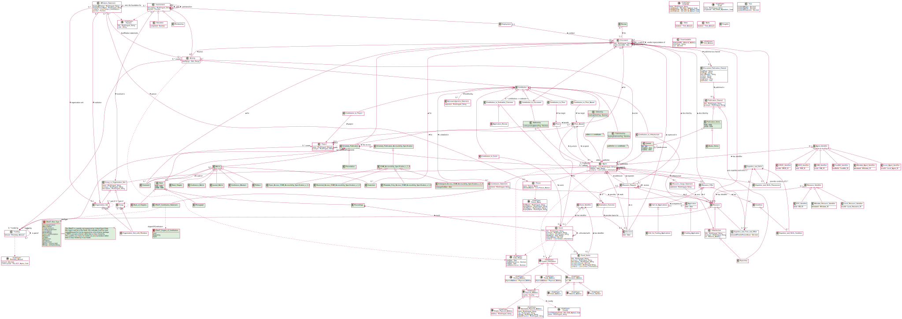
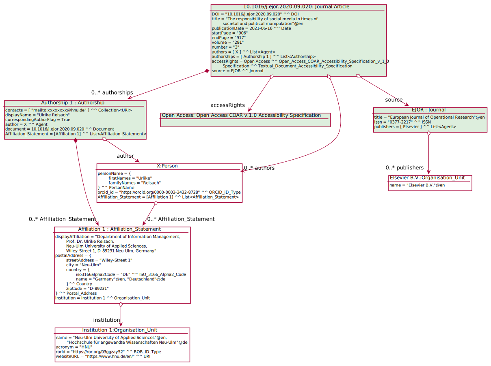

# CERIF Scholarly Publications Module

A module to represent scholarly publications in the refactored CERIF.
Its secondary purpose is to demonstrate the liason between the [CERIF Core](https://github.com/EuroCRIS/CERIF-Core) and a module.

## Status

(2021-07-06) Experimental.

## Scope

The Scholarly Publications Module consists of the following entities:
* [Document](https://github.com/EuroCRIS/CERIF-Core/blob/main/entities/Document.md) (imported from [the CERIF Core](https://github.com/EuroCRIS/CERIF-Core))
  * [Textual Document](https://github.com/EuroCRIS/CERIF-Core/blob/main/entities/Textual_Document.md) (imported from [the CERIF Core](https://github.com/EuroCRIS/CERIF-Core))
     * [Journal Article](./entities/Journal_Article.md)
     * [Monograph](./entities/Monograph.md)
* [Journal](./entities/Journal.md)
* [Contributorship](https://github.com/EuroCRIS/CERIF-Core/blob/main/entities/Contributorship.md) (imported from [the CERIF Core](https://github.com/EuroCRIS/CERIF-Core))
  * [Editorship](./entities/Editorship.md)
  * [Publishership](./entities/Publishership.md)
* [Contribution Statement](https://github.com/EuroCRIS/CERIF-Core/blob/main/entities/Contribution_Statement.md) (imported from [the CERIF Core](https://github.com/EuroCRIS/CERIF-Core))
  * [CRediT Contribution Statement](./entities/CRediT_Contribution_Statement.md)
* [Textual Document Accessibility Specification](https://github.com/EuroCRIS/CERIF-Core/blob/main/entities/Textual_Document_Accessibility_Specification.md) (imported from [the CERIF Core](https://github.com/EuroCRIS/CERIF-Core))
  * [COAR Accessibility Specification v1.0](./entities/COAR_Accessibility_Specification_v_1_0.md)
    * [Open Access](./entities/Open_Access_COAR_Accessibility_Specification_v_1_0.md)
    * [Restricted Access](./entities/Restricted_Access_COAR_Accessibility_Specification_v_1_0.md)
    * [Embargoed Access](./entities/Embargoed_Access_COAR_Accessibility_Specification_v_1_0.md)
    * [Metadata Only Access](./entities/Metadata_Only_Access_COAR_Accessibility_Specification_v_1_0.md)
    

And the following data types:
* [ISBN](./datatypes/ISBN.md)
* [ISSN](./datatypes/ISSN.md)
* CRediT
  * [Role Type](./datatypes/CRediT_Role_Type.md)
  * [Degree of Contribution](./datatypes/CRediT_Degree_of_Contribution.md)

## Illustrative Diagrams

## Usage note
This module cannot be used without the core.

## Development Tools

The [tools](./tools/) directory contains useful tools for checking the integrity of this repository.

* plantuml.jar should be used to generate SVG images by using Plant UML files. More details about this tool can be found at this [link](https://gist.github.com/thedmeyer/8b50362ae71ecbadabb17f8683c70ece). It might be run from the tools directory in terminal in this way

java -jar plantuml.jar -v -tsvg -r -o "../diagrams" "../diagrams/**.puml"

