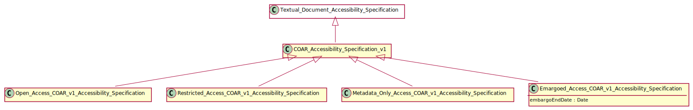

# COAR Accessibility Specification v1.0

## Definition
The COAR Access Rights vocabulary defines concepts to declare the access status of a resource. Multilingual labels regard regional distinctions in language and term. The Access Rights vocabulary builds on access rights defined in info:eu-repo/semantics. [1](#fn1)

## Usage notes
This is an abstract entity. There are four subclasses which should be used for [open access](../entities/Open_Access_COAR_Accessibility_Specification_v_1_0.md), 
[embargoed access](../entities/Embargoed_Access_COAR_Accessibility_Specification_v_1_0.md), 
[restricted access](../entities/Restricted_Access_COAR_Accessibility_Specification_v_1_0.md), 
[metadata only access](../entities/Metadata_Only_Access_COAR_Accessibility_Specification_v_1_0.md).

## Specialization of 
[Scholarly Publication Accessibility Rights](../entities/Scholarly_Publication_Accessibility_Specification.md)

## Illustrative Diagram

---

## Matches
1. Close match of [COAR access rights](http://vocabularies.coar-repositories.org/documentation/access_rights/)

## References
<a name="fn1">\[1\]</a> Source: Source: Controlled Vocabulary for Access Rights, http://vocabularies.coar-repositories.org/documentation/access_rights/
