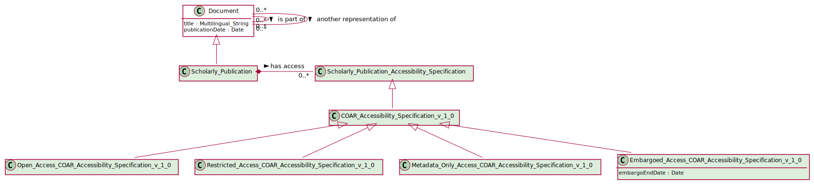

# COAR Accessibility Specification v1.0

## Definition
The COAR Access Rights vocabulary defines concepts to declare the access status of a resource. Multilingual labels regard regional distinctions in language and term. The Access Rights vocabulary builds on access rights defined in info:eu-repo/semantics. [1](#fn1)

## Usage notes
This is an abstract entity. There are four subclasses which should be used for open access, embargoed access, restricted access, metadata only access.

## Specialization of 
[Textual Document Accessibility Rights](https://github.com/EuroCRIS/CERIF-Core/blob/main/entities/Textual_Document_Accessibility_Specification.md)

## Generalization of 
[Open Access COAR Accessibility Specification v1.0](../entities/Open_Access_COAR_Accessibility_Specification_v_1_0.md)

[Embargoed Access COAR Accessibility Specification v1.0](../entities/Embargoed_Access_COAR_Accessibility_Specification_v_1_0.md)

[Restricted Access COAR Accessibility Specification v1.0](../entities/Restricted_Access_COAR_Accessibility_Specification_v_1_0.md)

[Metadata Only Access COAR Accessibility Specification v1.0](../entities/Metadata_Only_Access_COAR_Accessibility_Specification_v_1_0.md)

## Attributes

---

## Matches

## References
<a name="fn1">\[1\]</a> Source: Source: Controlled Vocabulary for Access Rights, http://vocabularies.coar-repositories.org/documentation/access_rights/
