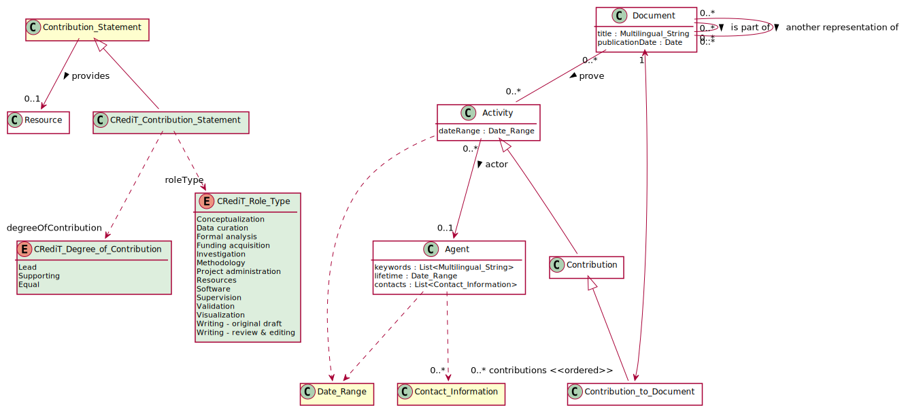

# CRediTContributionStatement

## Definition
A statement describing a contribution of an agent in producing a document in accordance with the CRediT contribution role taxonomy.

## Specialization of
[Contribution Statement](https://github.com/EuroCRIS/CERIF-Core/blob/main/entities/Contribution_Statement.md)

## Attributes
role type : [CRediT Role Type](../datatypes/CRediT_Role_Type.md)

degree of contribution : [CRediT Degree of Contribution](../datatypes/CRediT_Degree_of_Contribution.md)

---

## Matches

This statement matches the `<role>` XML element with `@vocab='credit'` of the JATS4R CRediT recommendation.[1](#fn1)

## References

<a name="fn1">\[1\]</a> *CRediT taxonomy.* In: JATS4R. Published 2020-09-21. Available from https://jats4r.org/credit-taxonomy
