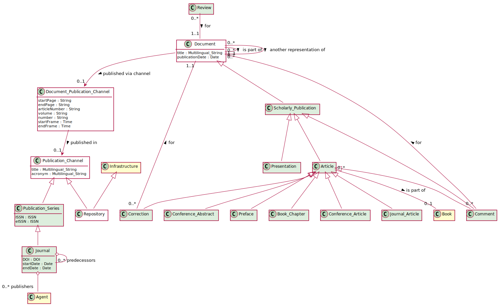

# Journal Article

An article on a particular topic and published in a journal issue. [1](#fn1)

## Usage notes
[FIXME] This class should be used for any type of journal article such as review article or researh article. 

## Specialization of

[Textual Document](https://github.com/EuroCRIS/CERIF-Core/blob/main/entities/Textual_Document.md)

## Attributes

Beside those inherited from [Document](https://github.com/EuroCRIS/CERIF-Core/blob/main/entities/Document.md#attributes), and [Textual Document](https://github.com/EuroCRIS/CERIF-Core/blob/main/entities/Textual_Document.md#attributes), there are the following attributes specific for this type of textual document:

startPage: [String](https://github.com/EuroCRIS/CERIF-Core/blob/main/datatypes/String.md)

endPage: [String](https://github.com/EuroCRIS/CERIF-Core/blob/main/datatypes/String.md)

volume: [String](https://github.com/EuroCRIS/CERIF-Core/blob/main/datatypes/String.md)

number: [String](https://github.com/EuroCRIS/CERIF-Core/blob/main/datatypes/String.md)

## Relationships
Those from [Document](https://github.com/EuroCRIS/CERIF-Core/blob/main/entities/Document.md#relationships), and [Textual Document](https://github.com/EuroCRIS/CERIF-Core/blob/main/entities/Textual_Document.md#relationships).

A journal article should contain information about *[journal](../entities/Journal.md)* in which it is published.

## Illustrative Diagram

### Class diagram

### Example usage

Please, find an example at [Juurnal Article example](../examples/Journal_Article_Example1.md)

## Matches

1. Close match of [COAR Journal Article](http://vocabularies.coar-repositories.org/documentation/resource_types/#http://purl.org/coar/resource_type/c_6501)
2. Close match of [Fabio Journal Article](https://sparontologies.github.io/fabio/current/fabio.html#d4e3646)
3. Narrow match of [Bibo Article](http://purl.org/ontology/bibo/Article)
4. Narrow match of [Schema.org Article](https://schema.org/Article) 

## References

<a name="fn1">\[1\]</a> Source: COAR resource types vocabulary, http://purl.org/coar/resource_type/c_6501
