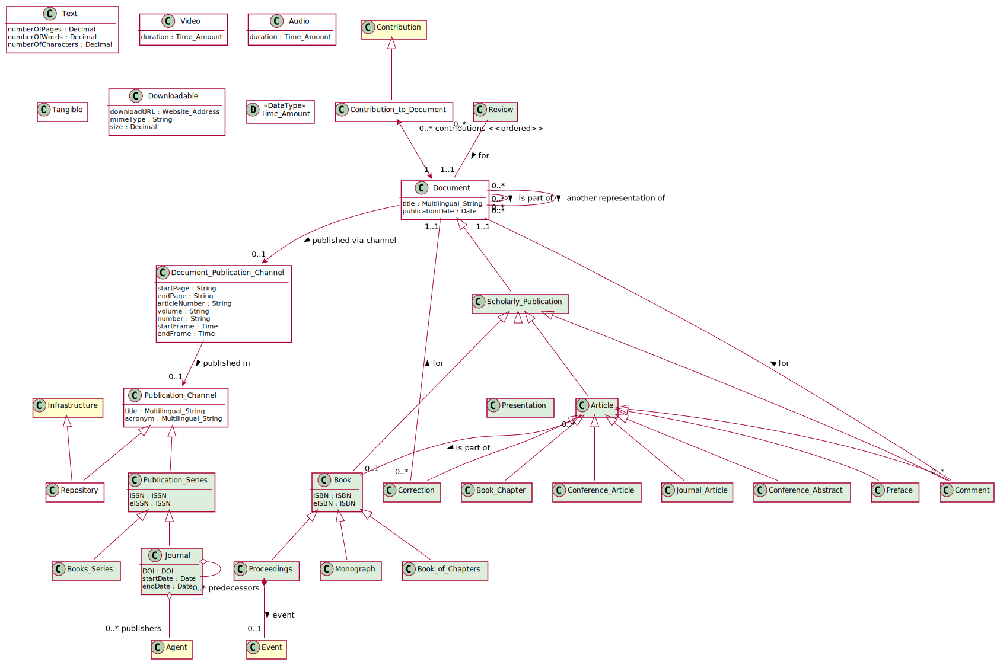

# Scholarly Publication

## Definition
A resource consisting primarily of words for reading.[1](#fn1)

## Usage notes
This entity includes scholarly publications which contain results of research (articles, proceedings papers, books, reports, ...) and it can also include other documents with a connection to research (funding or other contracts, project reports, data management plans, ...). 
This entity typically represents the granularity level of a single published item for which attribution information is attached (usually in the form of a list of authors and contributors).[2](#fn2) 
This entity is NOT used to represent publishing channels and sources: journals and book series (incl. continuing conference proceedings series).

## Specialization of
[Document](https://github.com/EuroCRIS/CERIF-Core/blob/main/entities/Document.md)

## Attributes
Those of [Document](https://github.com/EuroCRIS/CERIF-Core/blob/main/entities/Document.md#attributes)

## Relationships
Those of [Document](https://github.com/EuroCRIS/CERIF-Core/blob/main/entities/Document.md#relationships) plus:

A Scholarly Publication has an optional *access rights specification*: an instance of [Scholarly Publication Accessibility Specification](../entities/Scholarly_Publication_Accessibility_Specification.md).

<a name="rel__has-authorship">has-authorship</a> / [of-document](../entities/Authorship.md#user-content-rel__of-document) : A Scholarly Publication can have any number of [Authorships](../entities/Authorship.md). This relationship is derived from [Document.has-contribution](https://github.com/EuroCRIS/CERIF-Core/blob/main/entities/Document.md#user-content-rel__has-contribution) by including just those [Contributions to Documents](https://github.com/EuroCRIS/CERIF-Core/blob/main/entities/Contribution_to_Document.md) that are [Authorships](../entities/Authorship.md).

<a name="rel__has-author">has-author</a> : A Scholarly Publication has any number of authors, instances of [Agent](https://github.com/EuroCRIS/CERIF-Core/blob/main/entities/Agent.md). This relationship is derived: it relates the Scholarly Publication with the *actors* of its *authorships*. This is a simplified form expressing *authorships* without any additional qualification or context.

## Illustrative Diagram

---
## Matches
(FIXME)
1. Close match of [COAR Text](http://vocabularies.coar-repositories.org/documentation/resource_types/#http://purl.org/coar/resource_type/c_18cf)

## References
<a name="fn1">\[1\]</a> Adapted from: The COAR resource types vocabulary, http://vocabularies.coar-repositories.org/documentation/resource_types/#http://purl.org/coar/resource_type/c_18cf

<a name="fn2">\[2\]</a> Adapted from: The OpenAIRE guidelines for CRIS managers, https://openaire-guidelines-for-cris-managers.readthedocs.io/en/v1.1.1/cerif_xml_publication_entity.html

