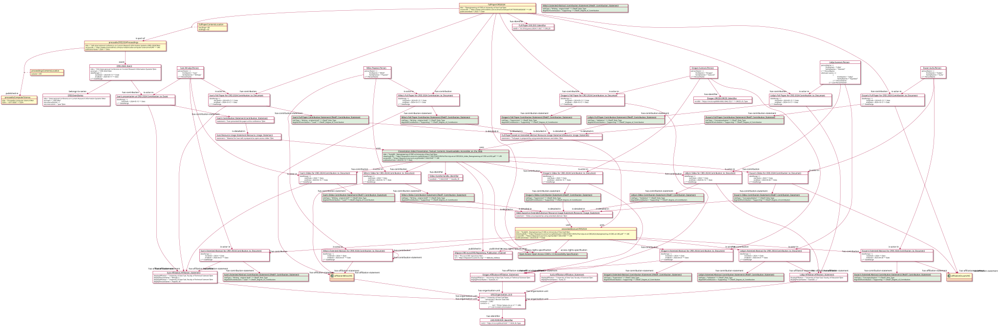

# Presentation Example

## Description
The example provides representation of the following paper presented at the CRIS 2024 conference in CERIF format by using [Contribution to Document](https://github.com/EuroCRIS/CERIF-Core/blob/main/entities/Contribution_to_Document.md) and associate entities:

````
Mršulja, I., Popović, M., Ivanović, D., Ivanović, L., & Surla, D. (2024). Reengineering of CRIS at University of Novi Sad. 
Procedia Computer Science, 249, 85-93.
DOI: https://doi.org/10.1016/j.procs.2024.11.052
````


## Illustrative diagram



## Serialization

TODO:
[Conference Paper Example serialization](../serializations/RDF/conferenceArticleExample.ttl)