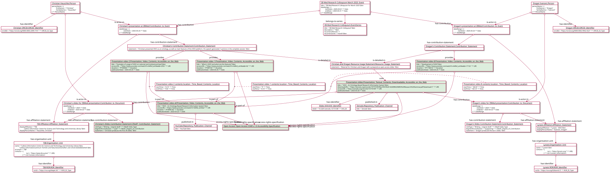

# Presentation Example

## Description
The example provides representation of the following presentation in CERIF format by using [Contribution to Event](https://github.com/EuroCRIS/CERIF-Core/blob/main/entities/Contribution_to_Event.md) and associate entities:

````
Christian Hauschke and Dragan Ivanovic (2025). "VIVO – An Ontology-Based Research Information System." 
ZBMed Research Seminar - March 2025
DOI: https://doi.org/10.5281/zenodo.15773108
````


## Illustrative diagram



## Serialization

TODO:
[Presentation Example serialization](../serializations/RDF/journalArticleExample1.owl)