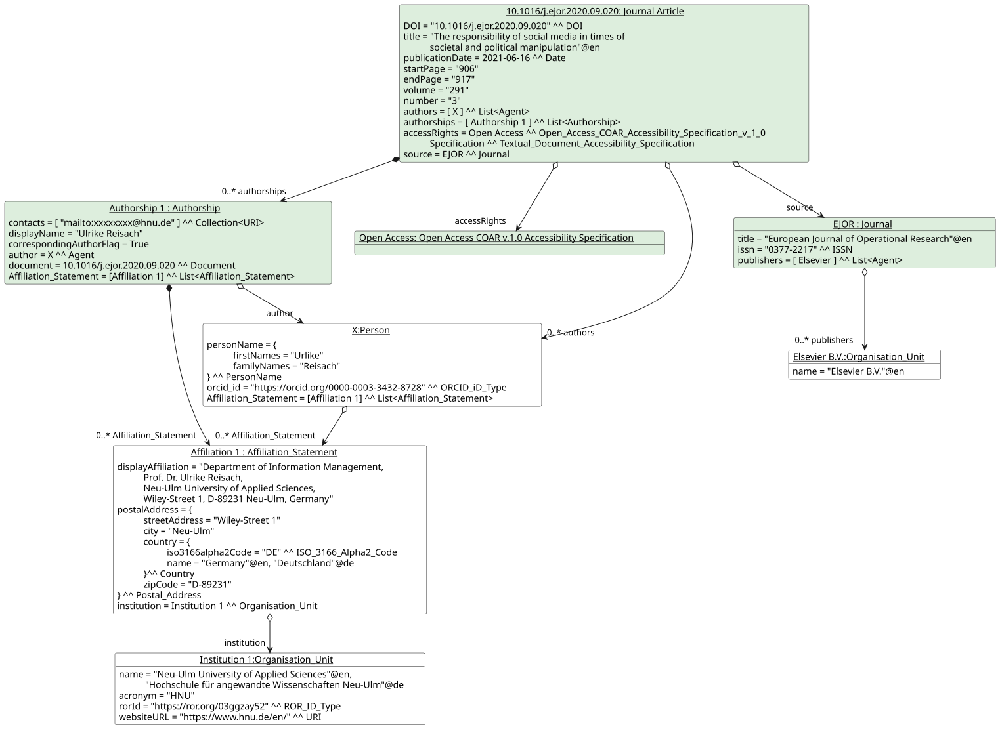
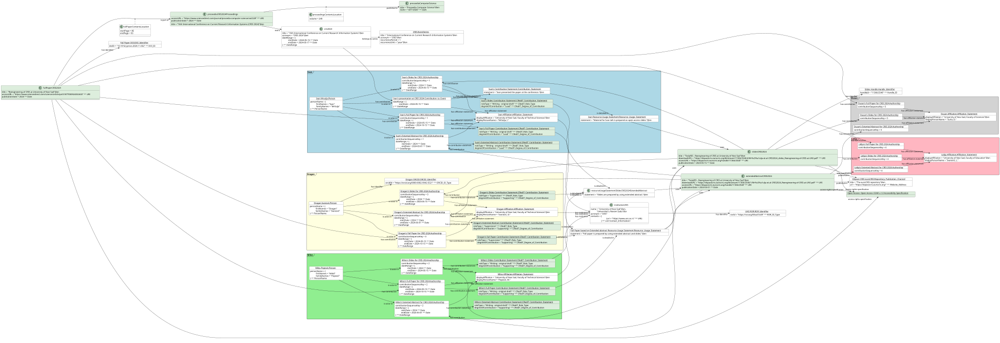
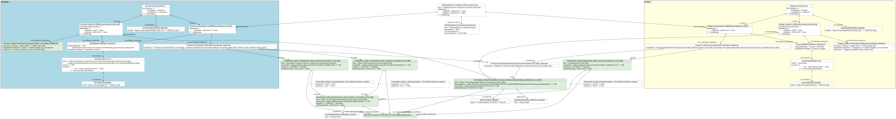

# Examples of usage for CERIF Scholarly Publications Module

The module includes the following examples:
* [Journal Article](#journal-article-example)
* [Conference Paper](#conference-paper-example)
* [Presentation](#presentation-example)

## Journal Article Example

### Description
The example provides representation of the following journal article in CERIF format by using [Journal Article entity](../entities/Journal_Article.md) and associate entities:

````
Reisach, Ulrike. "The responsibility of social media in times of societal and political manipulation." 
European Journal of Operational Research 291, no. 3 (2021): 906-917. 
DOI: https://doi.org/10.1016/j.ejor.2020.09.020
````


### Illustrative diagram



### Serialization

[Journal Article Example serialization](01_Journal_Article/example01.ttl)

## Conference Paper Example

### Description
The example provides representation of the following paper presented at the CRIS 2024 conference in CERIF format by using [Contribution to Document](https://github.com/EuroCRIS/CERIF-Core/blob/main/entities/Contribution_to_Document.md) and associate entities:

````
Mršulja, I., Popović, M., Ivanović, D., Ivanović, L., & Surla, D. (2024). Reengineering of CRIS at University of Novi Sad. 
Procedia Computer Science, 249, 85-93.
DOI: https://doi.org/10.1016/j.procs.2024.11.052
````


### Illustrative diagram



### Serialization

[Conference Paper Example serialization](02_Conference_Paper/example02.ttl)

## Presentation Example

### Description
The example provides representation of the following presentation in CERIF format by using [Contribution to Event](https://github.com/EuroCRIS/CERIF-Core/blob/main/entities/Contribution_to_Event.md) and associate entities:

````
Christian Hauschke and Dragan Ivanovic (2025). "VIVO – An Ontology-Based Research Information System." 
ZBMed Research Seminar - March 2025
DOI: https://doi.org/10.5281/zenodo.15773108
````


### Illustrative diagram



### Serialization

[Presentation Example serialization](03_Presentation/example03.ttl)

